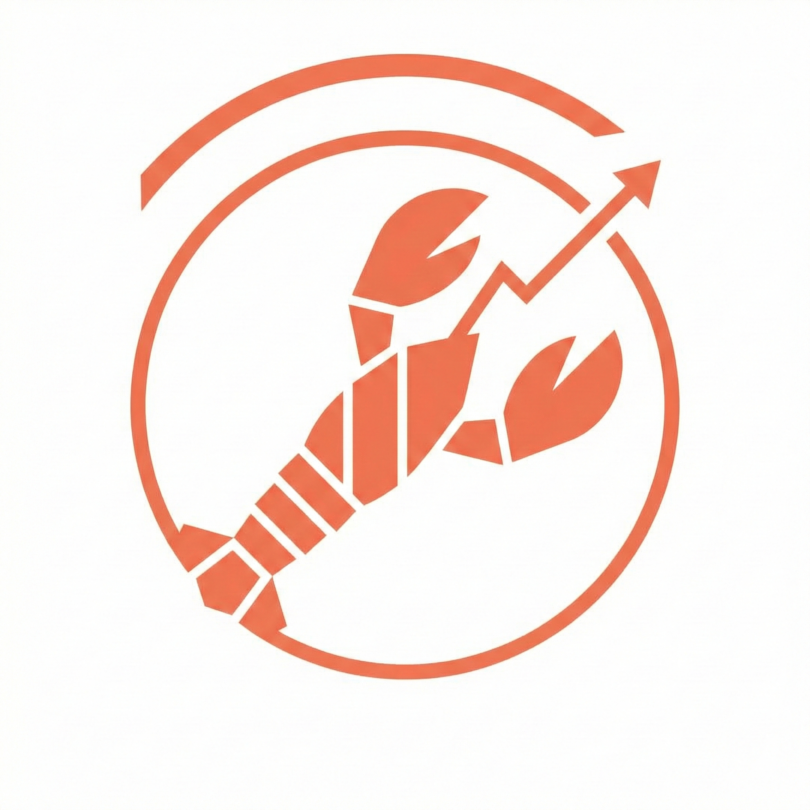

# Claw Journal 🦞

> Local observability dashboard for OpenClaw — track tokens, costs, and agent reasoning without cloud dependencies.


<p align="center">
   
</p>

**Claw Journal** is an advanced observability and analytics skill for OpenClaw. It provides a dedicated web dashboard to track, visualize, and audit your OpenClaw usage with local-first data collection.


> ⚠️ **Note:** Standard OpenClaw tools often hide cost metrics when using OAuth. Claw Journal aims to bridge this gap by providing local, detailed tracking for power users.

## Why Claw Journal?

- **See actual spend:** Token and cost tracking even when provider billing data is hidden.
- **Audit agent behavior:** Session-level reasoning and tool invocation visibility.
- **Stay local-first:** Data collection and storage run on your own machine.

## 🧭 Recommended Architecture (Single Source of Truth)

Run Claw Journal **on the OpenClaw host only**.

- OpenClaw transcripts + logs live on that host.
- Claw Journal DB lives on that host.
- Any laptop/desktop views the dashboard through SSH tunneling.

This avoids fragmented local caches across multiple viewer machines and ensures one consolidated history.

## ⚡ Quick Start

### Option A: Local (Same Machine)

If OpenClaw runs on this computer:

1. **Configure:** Copy and check defaults.
   ```bash
   cp .env.example .env
   # Default assumes logs at /tmp/openclaw/openclaw-*.log
   ```
2. **Run:** Start the dashboard.
   ```bash
   ./scripts/start-dashboard.sh
   ```

### Option B: Host Run + SSH View (Recommended)

If OpenClaw runs on a server/VM:

1. **SSH to the OpenClaw host and run Claw Journal there:**
   ```bash
   ssh user@your-host
   cd ~/claw-journal
   ./scripts/start-dashboard.sh
   ```

2. **From your local machine, tunnel the dashboard ports:**
   ```bash
   ssh -L 5173:127.0.0.1:5173 -L 3000:127.0.0.1:3000 user@your-host
   ```

- **Dashboard:** `http://localhost:5173`
- **Chat History:** `http://localhost:5173/chat`

> Advanced mode: running Claw Journal on a separate machine over SSH ingest is still possible, but host-run mode is recommended for a single persistent source of truth.

---

## 🚀 Features

Claw Journal runs as a local service alongside your OpenClaw instance to capture and display:

### 📊 Comprehensive Usage Analytics
- **Token Tracking:** Real-time breakdown of input/output tokens parsed directly from OpenClaw session logs.
- **Cost Observability:** Accurate cost estimation even for OAuth providers where API cost data is hidden.
- **Visual Graphs:** Interactive charts showing usage trends over time.

### 🧠 Agent Logic & Reasoning
- **Conversation Logs:** Searchable archive of your interactions.
- **Thinking Process Annotation:** Visualize "Wait... thinking" blocks and internal reasoning steps.
- **Sub-Agent Tracking:** See when specific sub-agents or tools were invoked.

---

## 📚 Documentation

<details>
<summary><strong>Installing & Configuring</strong></summary>

Full setup instructions, including manual installation steps and detailed `.env` reference.

[View Installation Guide](./docs/INSTALLATION.md)
</details>

<details>
<summary><strong>Remote Access (SSH)</strong></summary>

How to connect to a remote OpenClaw instance or tunnel the Control UI.

[View Remote Access Guide](./docs/REMOTE_ACCESS.md)
</details>

<details>
<summary><strong>Troubleshooting</strong></summary>

Common issues with ports, blank dashboards, and connectivity.

[View Remote Access & Troubleshooting](./docs/REMOTE_ACCESS.md#troubleshooting)
</details>

---

## 📌 Current Status

- ✅ Analytics backend MVP scaffolded (ingest, normalize, persist, query API)
- ✅ React graph dashboard available in `frontend/`
- ✅ Remote OpenClaw config contract added for hybrid integration
- ⏳ Alerts and forecasting are planned next phases

## 🗺️ Roadmap

- Track progress and upcoming milestones in GitHub Projects:
   - https://github.com/orgs/Ubundi/projects/1/views/1

## 🤝 Contributing

Contributions are welcome.

- Open an issue with a clear bug report or enhancement proposal.
- For first contributions, look for the `good first issue` label.
- Keep PRs focused and include setup/verification notes.

Planned repository docs:
- `CONTRIBUTING.md`
- `CODE_OF_CONDUCT.md`
- `SECURITY.md`

## 🌍 Community

- Discussions and support: open a GitHub Discussion or issue.
- Community chat link can be added here once a Discord/Slack channel is created.

## 📄 License

This project is open source under the MIT License.

## ✅ Maintainer Actions Needed

These items require human action to fully complete the OSS/public repo refactor:

1. Create `CONTRIBUTING.md` with PR workflow, development setup, and coding standards.
2. Add `CODE_OF_CONDUCT.md` (GitHub Community Standards template is fine).
3. Add `SECURITY.md` with private vulnerability disclosure instructions.
4. Add your community URL (Discord/Slack) into the Community section.

---
*Created for the OpenClaw community.*
