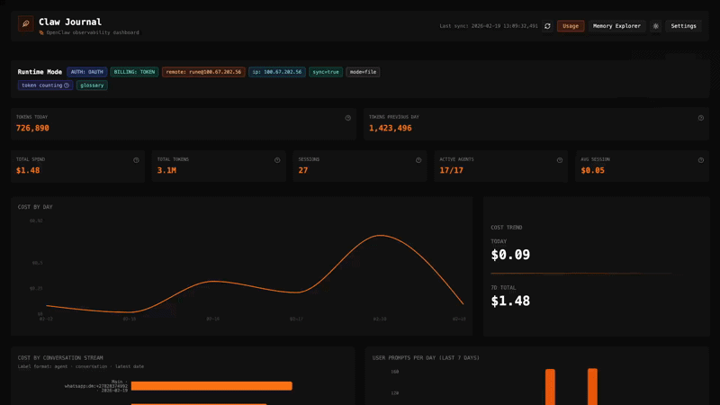

# Claw Journal 

> Local observability dashboard for OpenClaw — track tokens, costs, and agent reasoning without cloud dependencies.


<p align="center">
   
</p>

**Claw Journal** is an advanced observability and analytics skill for OpenClaw. It provides a dedicated web dashboard to track, visualize, and audit your OpenClaw usage with local-first data collection.


> ⚠️ **Note:** Standard OpenClaw tools often hide cost metrics when using OAuth. Claw Journal aims to bridge this gap by providing local, detailed tracking for power users.

## Why Claw Journal?

- **See actual spend:** Token and cost tracking even when provider billing data is hidden.
- **Audit agent behavior:** Session-level reasoning and tool invocation visibility.
- **Stay local-first:** Data collection and storage run on your own machine.

## Recommended Architecture (Single Source of Truth)

Run Claw Journal **on the OpenClaw host only**.

- OpenClaw transcripts + logs live on that host.
- Claw Journal DB lives on that host.
- Any laptop/desktop views the dashboard through SSH tunneling.

Default persistent storage on the host:
- DB: `./data/claw_journal.db`
- Runtime logs: `./data/logs/claw-journal-backend.log` and `./data/logs/claw-journal-frontend.log`

This avoids fragmented local caches across multiple viewer machines and ensures one consolidated history.

## Quick Start

### Option A: Local (Same Machine)

If OpenClaw runs on this computer:

1. **Configure:** Copy and check defaults.
   ```bash
   cp .env.example .env
   # Default assumes logs at /tmp/openclaw/openclaw-*.log
   ```
2. **Run:** Start the dashboard.
   ```bash
   ./scripts/start-dashboard.sh
   ```

### Option B: Host Run + SSH View (Recommended)

If OpenClaw runs on a server/VM:

1. **Install Claw Journal on the OpenClaw host (first time only):**
   ```bash
   ssh user@your-host
   cd ~
   git clone https://github.com/Ubundi/claw-journal.git
   cd claw-journal
   uv venv
   source .venv/bin/activate
   uv pip install -r requirements.txt
   cd frontend && npm install && cd ..
   cp .env.example .env
   ```

2. **Run Claw Journal on the host (single source of truth):**
   ```bash
   cd ~/claw-journal
   ./scripts/start-dashboard.sh
   ```

   If your non-interactive shell does not find `npm`, start with an explicit PATH:
   ```bash
   PATH=/opt/homebrew/bin:/usr/local/bin:$PATH ./scripts/start-dashboard.sh
   ```

3. **View directly on the host machine/browser:**
   - Dashboard: `http://127.0.0.1:5173`
   - API health: `http://127.0.0.1:3000/health`

4. **View from your laptop via SSH tunnel:**
   ```bash
   ssh -L 5173:127.0.0.1:5173 -L 3000:127.0.0.1:3000 user@your-host
   ```

- **Dashboard (local browser):** `http://127.0.0.1:5173`
- **API health (local browser):** `http://127.0.0.1:3000/health`

<details>
<summary><strong>SSH Tunnel Troubleshooting</strong></summary>

If your tunnel connects but `http://127.0.0.1:5173` says "site can't be reached" and SSH prints
`channel X: open failed: connect failed: Connection refused`, SSH is working but nothing is
listening on that port on the remote host.

1. Confirm remote listeners:
   ```bash
   ssh rune 'lsof -nP -iTCP -sTCP:LISTEN | egrep ":5173|:3000" || true'
   ```
   If this prints nothing, start Claw Journal on the remote host:
   ```bash
   ssh rune 'cd ~/claw-journal && ./scripts/start-dashboard.sh'
   ```

   If startup prints `Backend failed to start`, inspect backend logs:
    ```bash
   ssh rune 'tail -n 120 ~/claw-journal/data/logs/claw-journal-backend.log'
    ```
    Common fixes:
    - `Too many open files`: run with a higher fd limit (or set `CJ_OPEN_FILES_LIMIT`):
       ```bash
       ssh rune 'ulimit -n 65536; cd ~/claw-journal && ./scripts/start-dashboard.sh'
       ```
    - `npm: command not found` in non-interactive shells:
       ```bash
       ssh rune 'export PATH=/opt/homebrew/bin:/usr/local/bin:$PATH; cd ~/claw-journal && ./scripts/start-dashboard.sh'
       ```

2. Open a tunnel that fails fast if forwarding is invalid:
   ```bash
   ssh -N -o ExitOnForwardFailure=yes -L 5173:127.0.0.1:5173 -L 3000:127.0.0.1:3000 rune
   ```

3. Verify locally:
   - Dashboard: `http://127.0.0.1:5173`
   - API health: `http://127.0.0.1:3000/health`

Notes:
- `ssh rune && pwd` only validates login; it does not prove forwarded ports are backed by running services.
- If your service runs on different remote ports, update the `-L local:host:remote` mappings accordingly.
- If tunnel setup says `Address already in use`, a local process already owns `5173`/`3000`:
   ```bash
   lsof -nP -iTCP:5173 -sTCP:LISTEN
   lsof -nP -iTCP:3000 -sTCP:LISTEN
   ```

</details>

> Advanced mode: running Claw Journal on a separate machine over SSH ingest is still possible, but host-run mode is recommended for a single persistent source of truth.

---

## Features

Claw Journal runs as a local service alongside your OpenClaw instance to capture and display:


### Session Logs
- **Conversation Archive:** Searchable history of all your OpenClaw interactions.
- **Transcript Sync:** Ingest JSONL transcripts from local filesystem or remote hosts via SSH.

### Reasoning Chains
- **Thinking Process Annotation:** Visualize "Wait... thinking" blocks and internal reasoning steps.
- **Sub-Agent Tracking:** See when specific sub-agents or tools were invoked.

### Cost Tracking
- **Token Tracking:** Real-time breakdown of input/output tokens parsed directly from OpenClaw session logs.
- **Cost Observability:** Accurate cost estimation even for OAuth providers where API cost data is hidden.
- **Visual Graphs:** Interactive charts showing usage trends over time.

### Tool Review
- **Tool Usage Summary:** Invocation counts and success rates across all tools.
- **Agent Behavior Audit:** Review how agents selected and used tools within sessions.

---

## 📚 Documentation

<details>
<summary><strong>Installing & Configuring</strong></summary>

Full setup instructions, including manual installation steps and detailed `.env` reference.

[View Installation Guide](./docs/INSTALLATION.md)
</details>

<details>
<summary><strong>Remote Access (SSH)</strong></summary>

How to connect to a remote OpenClaw instance or tunnel the Control UI.

[View Remote Access Guide](./docs/REMOTE_ACCESS.md)
</details>

<details>
<summary><strong>Troubleshooting</strong></summary>

Common issues with ports, blank dashboards, and connectivity.

[View Remote Access & Troubleshooting](./docs/REMOTE_ACCESS.md#troubleshooting)
</details>

---

##  Current Status

- ✅ Analytics backend MVP scaffolded (ingest, normalize, persist, query API)
- ✅ React graph dashboard available in `frontend/`
- ✅ Remote OpenClaw config contract added for hybrid integration
- ⏳ Alerts and forecasting are planned next phases

## 🗺️ Roadmap

- Track progress and upcoming milestones in GitHub Projects:
   - https://github.com/orgs/Ubundi/projects/1/views/1

##  Contributing

Contributions are welcome.

- Open an issue with a clear bug report or enhancement proposal.
- For first contributions, look for the `good first issue` label.
- Keep PRs focused and include setup/verification notes.

Please review our [Contributing Guidelines](CONTRIBUTING.md), [Code of Conduct](CODE_OF_CONDUCT.md), and [Security Policy](SECURITY.md) before participating.

## 🌍 Community

- Discussions and support: open a GitHub Discussion or issue.
- Community chat link can be added here once a Discord/Slack channel is created.

## 📄 License

This project is open source under the MIT License.

---
*Created for the OpenClaw community.*
